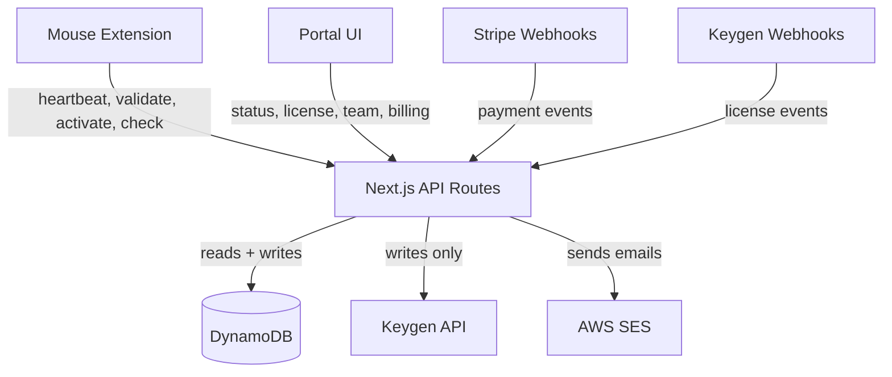
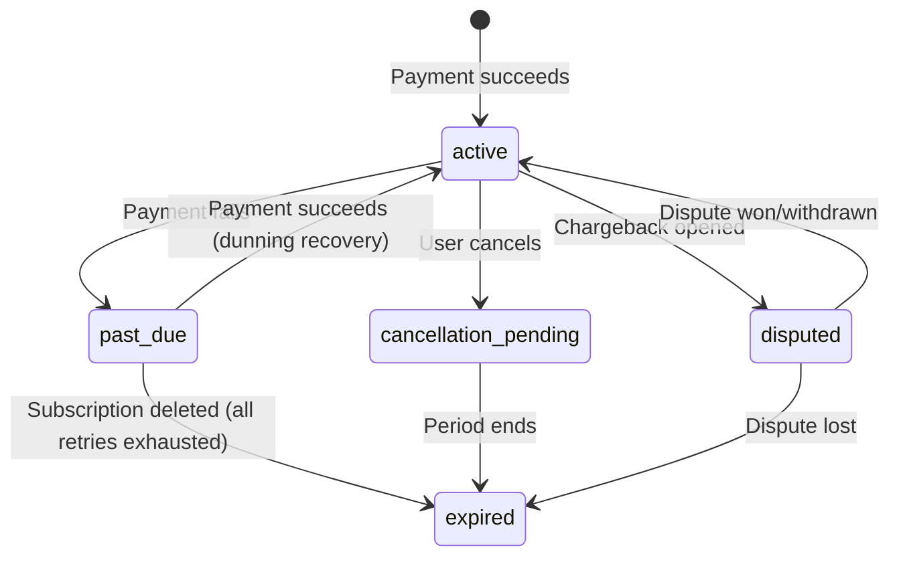
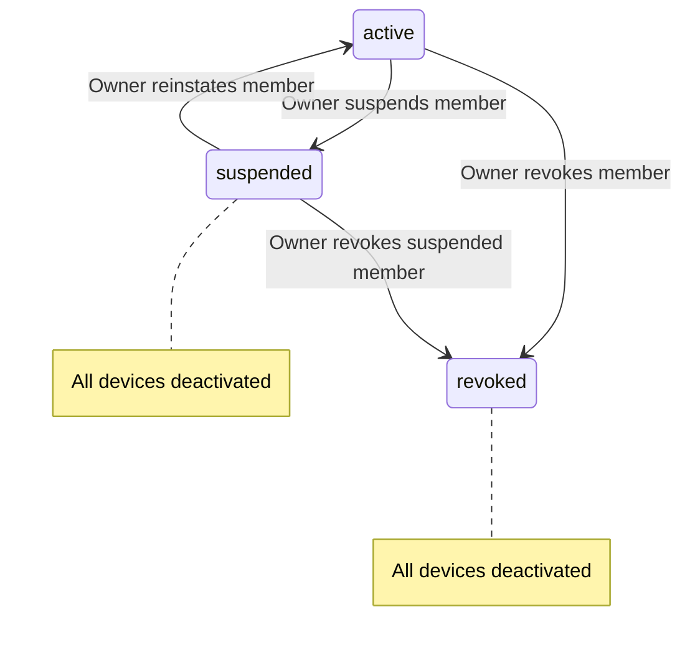

# Design Document: Status Remediation Plan

## Overview

This design covers the remediation of the license status and payment lifecycle system across the HIC platform. The remediation simplifies the payment lifecycle to `active → past_due → expired`, eliminates "suspended" from the payment path (reserving it solely for admin-suspended team members), normalizes all status values to lowercase, centralizes event type strings, replaces Keygen reads with DDB reads, and adds device deactivation on admin suspension/revocation.

The changes span two repos:
- **Website** (`plg-website/`): Next.js API routes, constants, webhook handlers, portal pages, DynamoDB module, Keygen module, email templates
- **Extension** (`hic/`): VS Code extension licensing client (heartbeat, validation, state management)

### Design Rationale

The current codebase has accumulated inconsistencies from iterative development:
1. Status casing mismatches between DDB (lowercase), Keygen (mixed), and application code (UPPER_CASE enum values)
2. "Suspended" used for both payment failures and admin actions, creating ambiguous semantics
3. Hardcoded event type strings scattered across webhook handlers, risking typos
4. Three endpoints still reading from Keygen at request time instead of DDB
5. No license renewal on payment success, causing Keygen expiration drift
6. Heartbeat endpoint not guarding against null licenses or blocked statuses
7. Portal misclassifying "past_due" as "expired"
8. No device deactivation when admin suspends/revokes a team member

Each fix is ordered by dependency (Requirement 14) so that foundational changes (dead code removal, casing normalization) land before behavioral changes (payment path, heartbeat, portal).

## Architecture

### System Context



### Key Architectural Decision: DDB as Sole Read Source

After remediation, DynamoDB is the sole source of truth for all reads. Keygen is used only for write-side operations (create, renew, suspend, reinstate, revoke licenses; activate, deactivate devices). This eliminates runtime dependency on Keygen availability for read paths and reduces latency.

### Affected File Map

| Fix | Files Modified |
|-----|---------------|
| Fix 6 (RETIRED) | `plg-website/src/lib/constants.js`, constants tests |
| Fix 3 (Casing) | `plg-website/src/lib/constants.js`, `plg-website/src/lib/keygen.js`, portal dashboard/license pages, PLG metrics script, extension `licensing/constants.js`, extension state module |
| Fix 8 (EVENT_TYPES) | `plg-website/src/lib/constants.js`, `plg-website/src/app/api/webhooks/stripe/route.js`, `plg-website/src/app/api/webhooks/keygen/route.js`, `plg-website/src/app/api/portal/team/route.js`, `dm/layers/ses/src/email-templates.js` |
| Fix 5 (Suspended) | `plg-website/src/app/api/webhooks/stripe/route.js`, `plg-website/src/app/api/webhooks/keygen/route.js`, `plg-website/src/lib/constants.js`, `dm/layers/ses/src/email-templates.js`, extension heartbeat/validation/HTTP client/VSCode modules |
| Fix 1 (renewLicense) | `plg-website/src/lib/keygen.js`, `plg-website/src/app/api/webhooks/stripe/route.js` |
| Fix 2 (Heartbeat) | `plg-website/src/app/api/license/heartbeat/route.js` |
| Fix 4 (Portal status) | `plg-website/src/app/api/portal/status/route.js` |
| Fix 7 (Keygen reads) | `plg-website/src/app/api/license/validate/route.js`, `plg-website/src/app/api/portal/license/route.js`, `plg-website/src/app/api/license/check/route.js` |
| Fix 9 (Admin suspension) | `plg-website/src/app/api/portal/team/route.js`, `plg-website/src/app/api/license/activate/route.js` |


## Components and Interfaces

### 1. Constants Module (`plg-website/src/lib/constants.js`)

**Changes:**
- Remove `RETIRED` from `LICENSE_STATUS` and `LICENSE_STATUS_DISPLAY`
- Change all `LICENSE_STATUS` values to lowercase strings (keys remain UPPER_CASE)
- Change all `LICENSE_STATUS_DISPLAY` keys to lowercase
- Remove `MAX_PAYMENT_FAILURES` export
- Add `EVENT_TYPES` enum with all event type strings

```javascript
// Before
export const LICENSE_STATUS = {
  ACTIVE: "ACTIVE",
  RETIRED: "RETIRED",
  // ...
};

// After
export const LICENSE_STATUS = {
  PENDING_ACCOUNT: "pending_account",
  TRIAL: "trial",
  ACTIVE: "active",
  PAST_DUE: "past_due",
  CANCELLATION_PENDING: "cancellation_pending",
  CANCELED: "canceled",
  EXPIRED: "expired",
  DISPUTED: "disputed",
  REVOKED: "revoked",
  SUSPENDED: "suspended",
};

export const EVENT_TYPES = {
  CUSTOMER_CREATED: "CUSTOMER_CREATED",
  LICENSE_CREATED: "LICENSE_CREATED",
  PAYMENT_FAILED: "PAYMENT_FAILED",
  SUBSCRIPTION_REACTIVATED: "SUBSCRIPTION_REACTIVATED",
  CANCELLATION_REQUESTED: "CANCELLATION_REQUESTED",
  CANCELLATION_REVERSED: "CANCELLATION_REVERSED",
  VOLUNTARY_CANCELLATION_EXPIRED: "VOLUNTARY_CANCELLATION_EXPIRED",
  NONPAYMENT_CANCELLATION_EXPIRED: "NONPAYMENT_CANCELLATION_EXPIRED",
  TEAM_INVITE_CREATED: "TEAM_INVITE_CREATED",
  TEAM_INVITE_RESENT: "TEAM_INVITE_RESENT",
};
```

### 2. Keygen Module (`plg-website/src/lib/keygen.js`)

**Changes:**
- Add `renewLicense(licenseId)` function calling `POST /licenses/{id}/actions/renew`
- Normalize all returned status values to lowercase via a helper

```javascript
/**
 * Renew a Keygen license to reset its expiration clock.
 * Called on every successful Stripe payment.
 * @param {string} licenseId - Keygen license UUID
 * @returns {Promise<Object>} Renewed license data
 */
export async function renewLicense(licenseId) {
  return keygenRequest(`/licenses/${licenseId}/actions/renew`, {
    method: "POST",
  });
}
```

### 3. Stripe Webhook Handler (`plg-website/src/app/api/webhooks/stripe/route.js`)

**Changes to `handlePaymentFailed`:**
- Remove `MAX_PAYMENT_FAILURES` import and the `>= MAX_PAYMENT_FAILURES` branch that writes "suspended"
- Always write "past_due" to DDB
- Add guard: skip write if current status is already "expired" (prevent overwriting terminal state)

**Changes to `handlePaymentSucceeded`:**
- Call `renewLicense(keygenLicenseId)` after successful payment
- Log warning and continue if `renewLicense` fails
- Skip `renewLicense` if customer has no `keygenLicenseId`
- Remove "suspended" from the reinstatement condition (only reinstate from "past_due")

**Changes to `handleSubscriptionDeleted`:**
- Remove "suspended" from the `priorStatus` check for `NONPAYMENT_CANCELLATION_EXPIRED`

**Changes to `handleSubscriptionUpdated`:**
- Remove `unpaid: "suspended"` from `statusMap` (replace with `unpaid: "expired"`)
- Remove reinstatement block for `"suspended"` status

**Changes to `handleDisputeClosed`:**
- Write "expired" (not "suspended") on lost dispute, preserving `fraudulent: true`

**All handlers:**
- Replace hardcoded event type strings with `EVENT_TYPES` enum references

### 4. Keygen Webhook Handler (`plg-website/src/app/api/webhooks/keygen/route.js`)

**Changes to `handleLicenseSuspended`:**
- Remove the DDB write (`updateLicenseStatus`) and email trigger
- Log the event only (Keygen suspension is now a side effect of our own `suspendLicense` calls)

**All handlers:**
- Replace hardcoded event type strings with `EVENT_TYPES` enum references

### 5. Heartbeat Endpoint (`plg-website/src/app/api/license/heartbeat/route.js`)

**Changes:**
- After `getLicenseByKey`, if result is `null`, return HTTP 404 with `{ valid: false, error: "License not found" }`
- Add status check: if license status is "expired", "suspended", or "revoked", return `{ valid: false, status, reason: "License is <status>" }`
- If license status is "active", "past_due", "cancellation_pending", or "trial", return `{ valid: true }` with status
- "past_due" returns `valid: true` because users retain full tool access during the dunning window

### 6. Portal Status Route (`plg-website/src/app/api/portal/status/route.js`)

**Changes:**
- Reclassify status categories:
  - Active: `["active", "trial", "cancellation_pending"]` (unchanged)
  - Past Due: `["past_due"]` (new category, currently lumped with expired)
  - Expired: `["canceled", "unpaid"]` → just `["expired"]`
- Remove "past_due" from `hasExpiredSubscription` array
- Add `hasPastDueSubscription` check
- Return "past_due" as its own status with full portal access

### 7. Validate Route (`plg-website/src/app/api/license/validate/route.js`)

**Changes:**
- Replace `validateLicense(licenseKey, fingerprint)` Keygen call with DDB reads: `getLicenseByKey(licenseKey)` + `getDeviceByFingerprint(licenseId, fingerprint)`
- Remove `validateLicense` import from keygen module
- Preserve trial flow (fingerprint-only path) unchanged

### 8. Portal License Route (`plg-website/src/app/api/portal/license/route.js`)

**Changes:**
- Remove `getKeygenLicense` call in `buildLicenseResponse`
- Use DDB `getLicense` data only for status, expiresAt, etc.
- Remove `import { getLicense as getKeygenLicense } from "@/lib/keygen"`

### 9. Check Route (`plg-website/src/app/api/license/check/route.js`)

**Changes:**
- Replace `getLicensesByEmail(email)` Keygen call with `getCustomerLicensesByEmail(email)` DDB call
- Remove `import { getLicensesByEmail } from "@/lib/keygen"`
- Adapt response mapping to use DDB license record shape

### 10. Team Route (`plg-website/src/app/api/portal/team/route.js`)

**Changes to `update_status` action:**
- When status is "suspended" or "revoked": query member's devices via `getUserDevices(keygenLicenseId, memberId)`, then for each device call `deactivateDevice(keygenMachineId)` (Keygen) and `removeDeviceActivation(keygenLicenseId, keygenMachineId, fingerprint)` (DDB)
- Resolve org's Keygen license ID: fetch org → get `ownerId` → get owner's customer record → `keygenLicenseId`
- Log warning and continue if individual Keygen deactivation fails (non-blocking)
- No-op device cleanup if member has zero devices
- When status is "active" (reinstatement): do NOT deactivate devices

**Replace hardcoded event type strings with `EVENT_TYPES` enum references.**

### 11. Activation Route (`plg-website/src/app/api/license/activate/route.js`)

**Changes:**
- After `validateLicense` returns `license.id`, check if this is a Business plan license (need license ID to look up `planName` from DDB)
- If Business: look up user's org membership via `getUserOrgMembership(userId)`
- If membership status is "suspended": return HTTP 403 with `{ code: "MEMBER_SUSPENDED", message: "Your team membership has been suspended. Contact your team administrator." }`
- If membership status is "revoked": return HTTP 403 with `{ code: "MEMBER_REVOKED", message: "Your team membership has been revoked. Contact your team administrator." }`
- Individual plan activations bypass this check entirely

### 12. Email Templates (`dm/layers/ses/src/email-templates.js`)

**Changes:**
- Remove `licenseSuspended` template
- Remove `LICENSE_SUSPENDED` from `EVENT_TYPE_TO_TEMPLATE`
- Remove `licenseSuspended` from `TEMPLATE_NAMES`
- Use `EVENT_TYPES` enum values as keys in `EVENT_TYPE_TO_TEMPLATE`

### 13. Extension Changes (in `hic` repo)

**Heartbeat module:** Remove `_handleLicenseSuspended` handler and `case "suspended"` / `case "license_suspended"` branches. Map "past_due" to active state (tools continue working).

**Validation module:** Remove "suspended" from `VALID_HEARTBEAT_STATUSES`.

**HTTP client:** Remove `response.license?.status === "suspended"` check.

**VSCode module:** Remove suspended-specific status bar and notification handling.

**Validate command:** Remove suspended status mapping.

**Constants:** Change `LICENSE_STATES` values to lowercase.

**State module:** Add migration logic to normalize any persisted UPPER_CASE status values to lowercase on load.

## Data Models

### DynamoDB Tables (No Schema Changes)

The remediation does not add or remove DynamoDB tables or attributes. The changes are to the values written:

| Field | Before | After |
|-------|--------|-------|
| `customer.subscriptionStatus` | Mixed case, includes "suspended" for payment failures | Lowercase only, "past_due" for payment failures |
| `license.status` | Mixed case, includes "suspended" | Lowercase only, no "suspended" in payment path |
| `event.eventType` | Hardcoded strings | `EVENT_TYPES` enum values (same strings, but sourced from enum) |

### Status Value Mapping

| Status | Payment Path | Admin Path | Heartbeat Response |
|--------|-------------|------------|-------------------|
| `active` | ✅ Valid | — | `valid: true` |
| `trial` | ✅ Valid | — | `valid: true` |
| `past_due` | ✅ Dunning window | — | `valid: true` |
| `cancellation_pending` | ✅ Until period end | — | `valid: true` |
| `expired` | ❌ Terminal | — | `valid: false` |
| `suspended` | ❌ Not used | Admin-suspended member | `valid: false` |
| `revoked` | ❌ Not used | Admin-revoked member | `valid: false` |

### Payment Lifecycle State Machine



### Admin Suspension State Machine (Business Only)




## Correctness Properties

*A property is a characteristic or behavior that should hold true across all valid executions of a system — essentially, a formal statement about what the system should do. Properties serve as the bridge between human-readable specifications and machine-verifiable correctness guarantees.*

### Property 1: LICENSE_STATUS values are lowercase and DISPLAY keys match

*For any* key-value pair in `LICENSE_STATUS`, the value must be a lowercase string. *For any* key in `LICENSE_STATUS_DISPLAY`, that key must exist as a value in `LICENSE_STATUS`.

**Validates: Requirements 2.1, 2.2**

### Property 2: Keygen status normalization

*For any* status string returned by the Keygen module (regardless of original casing), the returned value must be strictly lowercase.

**Validates: Requirements 2.3**

### Property 3: Extension LICENSE_STATES lowercase

*For any* value in the extension's `LICENSE_STATES` constants object, the value must be a lowercase string.

**Validates: Requirements 2.7**

### Property 4: Extension state migration normalizes to lowercase

*For any* persisted status string (including UPPER_CASE values from prior installs), loading it through the state module must produce a lowercase result equal to the original value lowercased.

**Validates: Requirements 2.8**

### Property 5: Payment failure always writes "past_due"

*For any* `invoice.payment_failed` event with any `attempt_count` value, `handlePaymentFailed` must write `subscriptionStatus: "past_due"` to DDB and must never write `"suspended"`, unless the customer's current status is already `"expired"` (in which case the write is skipped entirely).

**Validates: Requirements 4.1, 4.2**

### Property 6: Lost dispute writes "expired" with fraudulent flag

*For any* `charge.dispute.closed` event where `dispute.status` is not in `["won", "withdrawn", "warning_closed"]`, `handleDisputeClosed` must write `subscriptionStatus: "expired"` with `fraudulent: true` to DDB, and must never write `"suspended"`.

**Validates: Requirements 4.6**

### Property 7: Payment success calls renewLicense

*For any* `invoice.payment_succeeded` event where the resolved customer has a `keygenLicenseId`, `handlePaymentSucceeded` must call `renewLicense(keygenLicenseId)`.

**Validates: Requirements 6.2**

### Property 8: renewLicense failure does not block DDB active write

*For any* `invoice.payment_succeeded` event where `renewLicense` throws an error, `handlePaymentSucceeded` must still write `subscriptionStatus: "active"` to DDB and must not propagate the error.

**Validates: Requirements 6.3**

### Property 9: Heartbeat status classification

*For any* license record returned by `getLicenseByKey`, the heartbeat endpoint returns `valid: true` if and only if the license status is in `{"active", "past_due", "cancellation_pending", "trial"}`. For statuses in `{"expired", "suspended", "revoked"}`, it returns `valid: false` with the status and reason. If `getLicenseByKey` returns `null`, it returns HTTP 404.

**Validates: Requirements 7.1, 7.2, 7.3, 7.4**

### Property 10: Portal status classification

*For any* customer subscription status, the portal status route classifies it as: `"active"` if status is in `{"active", "trial", "cancellation_pending"}`; `"past_due"` if status is `"past_due"`; `"expired"` if status is `"expired"`. All statuses receive full portal access.

**Validates: Requirements 8.1, 8.2, 8.3, 8.4, 8.5**

### Property 11: Validate route reads from DDB only

*For any* license validation request with a license key, the validate route must call `getLicenseByKey` and `getDeviceByFingerprint` from the DDB module and must not call `validateLicense` from the Keygen module.

**Validates: Requirements 9.1, 9.4**

### Property 12: Portal license route reads from DDB only

*For any* portal license request, `buildLicenseResponse` must use DDB `getLicense` data only and must not call `getKeygenLicense`.

**Validates: Requirements 9.2, 9.5**

### Property 13: Check route reads from DDB only

*For any* license check request by email, the check route must call `getCustomerLicensesByEmail` from DDB and must not call `getLicensesByEmail` from the Keygen module.

**Validates: Requirements 9.3, 9.6**

### Property 14: Suspend/revoke deactivates all member devices

*For any* team member with N devices (N ≥ 0), when the owner sets the member's status to `"suspended"` or `"revoked"`, the team route must call `deactivateDevice` (Keygen) and `removeDeviceActivation` (DDB) for each of the N devices. When N = 0, the operation completes successfully as a no-op.

**Validates: Requirements 10.1, 10.2, 10.7**

### Property 15: Keygen device deactivation failure is non-blocking

*For any* device where the Keygen `deactivateDevice` call fails during member suspension/revocation, the DDB `removeDeviceActivation` must still be called and the overall operation must complete successfully.

**Validates: Requirements 10.3**

### Property 16: Reinstatement does not deactivate devices

*For any* team member status change to `"active"` (reinstatement), zero calls to `deactivateDevice` or `removeDeviceActivation` must be made.

**Validates: Requirements 10.4**

### Property 17: Business activation blocked for suspended/revoked members

*For any* device activation request on a Business plan license where the user's org membership status is `"suspended"` or `"revoked"`, the activation route must return HTTP 403 with the appropriate code (`MEMBER_SUSPENDED` or `MEMBER_REVOKED`).

**Validates: Requirements 11.1, 11.2, 11.3**

### Property 18: Active Business members proceed with activation

*For any* device activation request on a Business plan license where the user's org membership status is `"active"`, the activation route must proceed with normal activation (no 403 response).

**Validates: Requirements 11.4**

### Property 19: Individual plan activations skip membership check

*For any* device activation request on an Individual plan license, the activation route must not call `getUserOrgMembership` and must proceed directly to activation regardless of any org membership state.

**Validates: Requirements 11.5**

### Property 20: Extension maps "past_due" to active

*For any* heartbeat response with status `"past_due"`, the extension heartbeat module must map it to an active state where all tools continue to work.

**Validates: Requirements 5.3**

### Property 21: renewLicense calls correct endpoint

*For any* `licenseId`, calling `renewLicense(licenseId)` must issue a `POST` request to `/licenses/{licenseId}/actions/renew` on the Keygen API.

**Validates: Requirements 6.1**

### Property 22: Payment success reinstates from past_due only

*For any* `invoice.payment_succeeded` event where the customer's prior status is `"past_due"`, `handlePaymentSucceeded` must write `subscriptionStatus: "active"` and call `reinstateLicense`. It must not check for or reinstate from `"suspended"`.

**Validates: Requirements 4.3**


## Error Handling

### Keygen API Failures (Non-Blocking Pattern)

All Keygen write operations follow a consistent non-blocking pattern:
- **Try** the Keygen API call
- **Catch** any error, log a warning with the error message
- **Continue** with the DDB write/response — Keygen sync failure never blocks the primary operation

This applies to:
- `renewLicense` in `handlePaymentSucceeded` (Property 8)
- `suspendLicense` in `handleSubscriptionDeleted`
- `reinstateLicense` in `handlePaymentSucceeded` and `handleDisputeClosed`
- `deactivateDevice` in team route device cleanup (Property 15)

### Heartbeat Null License Guard

Currently the heartbeat endpoint returns `valid: true, status: "active"` when `getLicenseByKey` returns null (license not in DDB). After remediation, this returns HTTP 404 with `{ valid: false, error: "License not found" }`. This is a security fix — CWE-862 (Missing Authorization) — preventing tool access without a valid license record.

### Terminal State Guard

`handlePaymentFailed` must check if the customer's current status is already `"expired"` before writing `"past_due"`. This prevents a race condition where a late-arriving `payment_failed` webhook overwrites the terminal `"expired"` state set by `subscription.deleted`.

### Device Deactivation Partial Failure

When deactivating multiple devices during member suspension/revocation, each device deactivation is independent. A Keygen failure for device A does not prevent DDB cleanup for device A or deactivation of device B. The operation logs all failures but completes successfully.

### Activation Route Membership Check

The org membership check in the activation route only applies to Business plan licenses. If `getUserOrgMembership` returns null for a Business plan user (edge case — user not in any org), the activation should proceed normally (fail-open for this specific check, since the license validation itself is the primary gate).

## Testing Strategy

### Testing Framework

- **Unit/Integration tests:** `dm/facade/test-helpers/index.js` (HIC's Jest-like replacement, zero external deps)
- **Property-based tests:** `dm/facade/test-helpers/index.js` (HIC's Jest-like replacement with PBT support, zero external deps)
- Each source file gets a companion `.test.js` in a parallel `tests/` directory
- Test both success and error paths
- Test behavior, not implementation details

### Property-Based Testing Configuration

- Minimum 100 iterations per property test
- Each property test must reference its design document property with a tag comment
- Tag format: `// Feature: status-remediation-plan, Property {number}: {property_text}`
- Each correctness property is implemented by a single property-based test
- Use `dm/facade/test-helpers` utilities to generate random statuses, license IDs, member IDs, device lists, invoice objects

### Unit Test Coverage

Unit tests complement property tests by covering:
- Specific examples (e.g., RETIRED not in enum, MAX_PAYMENT_FAILURES not exported)
- Edge cases (e.g., zero devices on suspension, null keygenLicenseId on payment success, expired status guard on payment failure)
- Integration points (e.g., Keygen webhook log-only behavior, email template removals)
- Structural assertions (e.g., no Keygen imports in migrated routes, no hardcoded event strings via grep)

### Test Organization by Fix

| Fix | Test File | Key Assertions |
|-----|-----------|---------------|
| Fix 6 | `tests/lib/constants.test.js` | No RETIRED in enum or display map |
| Fix 3 | `tests/lib/constants.test.js`, `tests/lib/keygen.test.js` | All values lowercase, Keygen normalization, extension state migration |
| Fix 8 | `tests/lib/constants.test.js` | EVENT_TYPES enum exists with all keys |
| Fix 5 | `tests/webhooks/stripe.test.js`, `tests/webhooks/keygen.test.js` | No "suspended" in payment path, log-only for Keygen suspension |
| Fix 1 | `tests/lib/keygen.test.js`, `tests/webhooks/stripe.test.js` | renewLicense exists and called on payment success, resilient to failure |
| Fix 2 | `tests/license/heartbeat.test.js` | 404 on null license, valid: false for blocked statuses, valid: true for allowed |
| Fix 4 | `tests/portal/status.test.js` | past_due is own category, correct classification |
| Fix 7 | `tests/license/validate.test.js`, `tests/portal/license.test.js`, `tests/license/check.test.js` | DDB reads only, no Keygen imports |
| Fix 9 | `tests/portal/team.test.js`, `tests/license/activate.test.js` | Device deactivation on suspend/revoke, 403 for blocked members, Individual bypass |

### Execution Order

Per Requirement 14, tests are run after each fix in dependency order. Each fix must achieve 100% pass rate before the next fix begins. The full test suite is run after each fix to catch regressions.

### Security Considerations

- **CWE-862 (Missing Authorization):** Heartbeat null license guard prevents unauthorized tool access
- **CWE-285 (Improper Authorization):** Activation route membership check prevents suspended/revoked members from re-activating
- **CWE-367 (TOCTOU Race):** Terminal state guard in payment failure handler prevents race between payment_failed and subscription.deleted webhooks
- **OWASP API Security:** Rate limiting preserved on all public endpoints; no new public endpoints introduced
