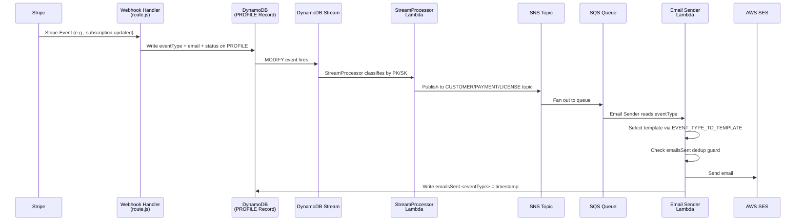
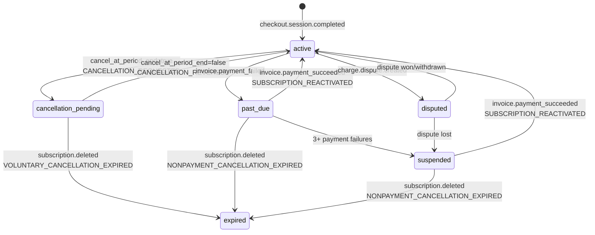
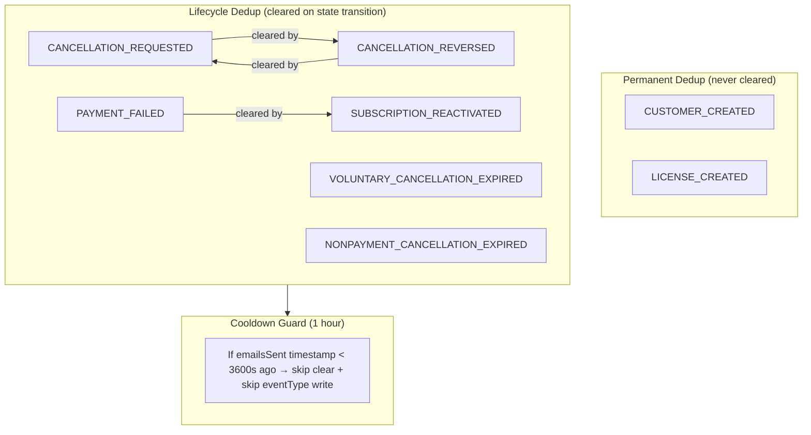

# Design Document — Stream 1D Completion Plan

## Overview

Stream 1D fixes two bugs in the subscription lifecycle email system and establishes the event-driven architecture needed for post-launch email engagement. The two bugs: (1) Cancel Subscription sends zero emails (permanent dedup guard blocks repeatable lifecycle events), and (2) Don't Cancel sends the wrong template (overloaded `SUBSCRIPTION_REACTIVATED` event type serves both payment recovery and cancellation reversal).

The fix introduces 4 new event types, 2 new subscription statuses, 4 new email templates, a split dedup strategy (permanent vs. clearable), a 1-hour cooldown guard, naming standardization, dead code removal, and portal UI updates. No CloudFormation stack changes required — only SES layer rebuild and Lambda redeployment.

### Key Design Decisions

1. **Split overloaded event types** rather than adding conditional template selection — cleaner event taxonomy, each event maps 1:1 to a template, simpler debugging.
2. **Cooldown guard in webhook handler** rather than in `updateCustomerSubscription` — avoids adding read-before-write complexity to the DynamoDB helper; the handler already has `dbCustomer` loaded.
3. **`expired` replaces `canceled`** as the terminal subscription status — `canceled` was ambiguous (Stripe uses it for both "pending cancellation" and "actually ended"). No migration needed since all existing records are throwaway test accounts.
4. **Org fan-out deferred** — cannot mathematically trigger until ~30 days post-launch. Individual flows are the priority.
5. **Win-back functions preserved but not wired up** — activating them requires CAN-SPAM-compliant unsubscribe infrastructure that doesn't exist yet.

## Architecture

### Email Pipeline Flow (Unchanged)



### Subscription State Machine (New)



### Dedup Strategy Architecture




## Components and Interfaces

### 1. Constants Module (`plg-website/src/lib/constants.js`)

Changes:
- Rename `LICENSE_STATUS.CANCELLED` → `LICENSE_STATUS.CANCELED` and update `LICENSE_STATUS_DISPLAY` label from "Cancelled" to "Canceled"
- Add `CANCELLATION_PENDING: "CANCELLATION_PENDING"` to `LICENSE_STATUS`
- Add `CANCELLATION_PENDING: { label: "Cancellation Pending", variant: "warning" }` to `LICENSE_STATUS_DISPLAY`
- Export `MAX_PAYMENT_FAILURES = 3`

### 2. DynamoDB Helper (`plg-website/src/lib/dynamodb.js`)

#### `updateCustomerSubscription` — Extended Signature

```javascript
/**
 * Update customer subscription fields on the PROFILE record.
 * Optionally clears specified emailsSent keys via REMOVE expressions.
 *
 * @param {string} userId - Customer user ID
 * @param {Object} updates - Key-value pairs to SET on the PROFILE record
 * @param {Object} [options] - Optional configuration
 * @param {string[]} [options.clearEmailsSent=[]] - emailsSent map keys to REMOVE
 * @returns {Promise<void>}
 */
async function updateCustomerSubscription(userId, updates, { clearEmailsSent = [] } = {})
```

The function builds a combined `SET` + `REMOVE` UpdateExpression:
- `SET` clause: all key-value pairs from `updates` (existing behavior)
- `REMOVE` clause: `emailsSent.#key` for each key in `clearEmailsSent` (new behavior)

DynamoDB supports combining `SET` and `REMOVE` in a single `UpdateExpression`: `SET #a = :a, #b = :b REMOVE emailsSent.#clearKey0, emailsSent.#clearKey1`

When `clearEmailsSent` is empty or not provided, no `REMOVE` clause is generated (backward compatible).

### 3. Webhook Handler (`plg-website/src/app/api/webhooks/stripe/route.js`)

#### `handleSubscriptionUpdated` — Modified Paths

Cancel path (`cancel_at_period_end: true`):
- Set `subscriptionStatus: "cancellation_pending"` (overrides `statusMap` result)
- Set `eventType: "CANCELLATION_REQUESTED"`
- Set `clearEmailsSent: ["CANCELLATION_REVERSED"]`
- Cooldown guard: check `dbCustomer.emailsSent?.CANCELLATION_REQUESTED` timestamp; if < 3600s ago, skip `eventType` and `clearEmailsSent` writes

Uncancel path (`cancel_at_period_end: false` && `dbCustomer.cancelAtPeriodEnd`):
- Set `subscriptionStatus: "active"`
- Set `eventType: "CANCELLATION_REVERSED"`
- Set `clearEmailsSent: ["CANCELLATION_REQUESTED"]`
- Same cooldown guard pattern for `CANCELLATION_REVERSED`

Pass `clearEmailsSent` to `updateCustomerSubscription` as third argument options object.

#### `handleSubscriptionDeleted` — Expiration Event Type Routing

```javascript
const priorStatus = dbCustomer.subscriptionStatus;
let expirationEventType;
if (priorStatus === "cancellation_pending") {
    expirationEventType = "VOLUNTARY_CANCELLATION_EXPIRED";
} else if (priorStatus === "past_due" || priorStatus === "suspended") {
    expirationEventType = "NONPAYMENT_CANCELLATION_EXPIRED";
} else {
    expirationEventType = "VOLUNTARY_CANCELLATION_EXPIRED"; // safe default
}
```

- Set `subscriptionStatus: "expired"` (not `"canceled"`)
- Set `canceledAt: new Date().toISOString()`
- Update Keygen license status to `"expired"` (not `"canceled"`)

#### `handlePaymentSucceeded` — Expanded Reactivation Trigger

- Expand status check: `dbCustomer.subscriptionStatus === "past_due" || dbCustomer.subscriptionStatus === "suspended"`
- Pass `clearEmailsSent: ["PAYMENT_FAILED"]` to clear payment failure dedup stamp

#### `statusMap` Update

- Change `canceled: "canceled"` → `canceled: "expired"` in the `statusMap` object within `handleSubscriptionUpdated`

#### Cooldown Guard Implementation

The cooldown guard lives in the webhook handler, not in `updateCustomerSubscription`. Pattern:

```javascript
// Check cooldown before writing lifecycle eventType
const COOLDOWN_SECONDS = 3600;
const priorTimestamp = dbCustomer.emailsSent?.[eventTypeToWrite];
const withinCooldown = priorTimestamp &&
    (Date.now() - new Date(priorTimestamp).getTime()) < COOLDOWN_SECONDS * 1000;

if (withinCooldown) {
    log.info("cooldown-guard", { eventType: eventTypeToWrite, priorTimestamp });
    // Still update subscriptionStatus, but skip eventType + clearEmailsSent
    delete subscriptionUpdate.eventType;
    delete subscriptionUpdate.email;
    clearEmailsSent = [];
}
```

### 4. Customer Update Lambda (`plg-website/infrastructure/lambda/customer-update/index.js`)

#### `handleSubscriptionUpdated` — Webhook-Handled Guard

Add guard at top of function:

```javascript
const eventType = getField(newImage, "eventType");
if (eventType) {
    log.info("webhook-handled", { eventType, reason: "skipping redundant customer-update write" });
    // Still execute license status updates (idempotent)
    // ... existing license update logic ...
    return;
}
```

#### `handleSubscriptionDeleted` — Taxonomy Alignment

- Change `subscriptionStatus: "canceled"` → `subscriptionStatus: "expired"`
- Add same webhook-handled guard as `handleSubscriptionUpdated`
- Update `updateLicenseStatus` call to use `"expired"` instead of `"canceled"`
- Determine expiration event type from prior status using same logic as webhook handler

### 5. Email Templates (`dm/layers/ses/src/email-templates.js`)

#### New Templates (4)

| Template Name | Event Type | Tone | Parameters |
|---|---|---|---|
| `cancellationRequested` | `CANCELLATION_REQUESTED` | Warm, slightly persuasive | `{ email, accessUntil }` |
| `cancellationReversed` | `CANCELLATION_REVERSED` | Warm, understated | `{ email }` |
| `voluntaryCancellationExpired` | `VOLUNTARY_CANCELLATION_EXPIRED` | Respectful, door-open | `{ email }` |
| `nonpaymentCancellationExpired` | `NONPAYMENT_CANCELLATION_EXPIRED` | Neutral, factual, helpful | `{ email }` |

#### Removed Templates/Mappings

- Remove `SUBSCRIPTION_CANCELLED` from `EVENT_TYPE_TO_TEMPLATE`
- Remove `TRIAL_ENDING` from `EVENT_TYPE_TO_TEMPLATE`
- Remove `"trialEnding"` from `TEMPLATE_NAMES`
- Remove `"cancellation"` from `TEMPLATE_NAMES`
- Remove `trialEnding` template from `createTemplates`

#### Updated `EVENT_TYPE_TO_TEMPLATE`

```javascript
export const EVENT_TYPE_TO_TEMPLATE = {
  LICENSE_CREATED: "licenseDelivery",
  LICENSE_REVOKED: "licenseRevoked",
  LICENSE_SUSPENDED: "licenseSuspended",
  CUSTOMER_CREATED: "welcome",
  CANCELLATION_REQUESTED: "cancellationRequested",
  CANCELLATION_REVERSED: "cancellationReversed",
  VOLUNTARY_CANCELLATION_EXPIRED: "voluntaryCancellationExpired",
  NONPAYMENT_CANCELLATION_EXPIRED: "nonpaymentCancellationExpired",
  SUBSCRIPTION_REACTIVATED: "reactivation",
  PAYMENT_FAILED: "paymentFailed",
  TEAM_INVITE_CREATED: "enterpriseInvite",
  TEAM_INVITE_RESENT: "enterpriseInvite",
};
```

#### Updated `TEMPLATE_NAMES`

```javascript
export const TEMPLATE_NAMES = [
  "welcome",
  "licenseDelivery",
  "paymentFailed",
  "reactivation",
  "cancellationRequested",
  "cancellationReversed",
  "voluntaryCancellationExpired",
  "nonpaymentCancellationExpired",
  "licenseRevoked",
  "licenseSuspended",
  "winBack30",
  "winBack90",
  "enterpriseInvite",
  "disputeAlert",
];
```

### 6. Email Sender Lambda (`plg-website/infrastructure/lambda/email-sender/index.js`)

- Remove `EMAIL_ACTIONS` alias; use `EVENT_TYPE_TO_TEMPLATE` directly throughout
- Add dedup type classification logging in Guard 2:

```javascript
const PERMANENT_DEDUP_EVENTS = ["CUSTOMER_CREATED", "LICENSE_CREATED"];

// In Guard 2:
if (emailsSentMap?.[eventType]) {
    const dedupType = PERMANENT_DEDUP_EVENTS.includes(eventType) ? "permanent" : "lifecycle";
    log.debug("already-sent", { eventType, dedupType });
    continue;
}
```

- No org fan-out logic (deferred to post-launch)

### 7. Scheduled Tasks Lambda (`plg-website/infrastructure/lambda/scheduled-tasks/index.js`)

- Update `handleWinback30` and `handleWinback90` query filters: `":status": "canceled"` → `":status": "expired"`
- Remove `handleTrialReminder` function (confirmed dead code)
- Remove `"trial-reminder"` from `TASK_HANDLERS` map
- Win-back functions remain preserved but NOT wired up in `TASK_HANDLERS` (deferred to post-launch — requires CAN-SPAM unsubscribe infrastructure)

### 8. SES Helper Module (`plg-website/src/lib/ses.js`)

- Remove `sendTrialEndingEmail` function (confirmed dead code)

### 9. Portal UI

#### `portal/page.js` — Billing Card

The billing card uses `LICENSE_STATUS_DISPLAY[subscriptionStatus?.toUpperCase()]`. Adding `CANCELLATION_PENDING` to `LICENSE_STATUS_DISPLAY` (Task 2b) makes this work automatically.

Additional UX: update billing card status text to handle `cancellation_pending`:

```javascript
subscriptionStatus === "active" || subscriptionStatus === "trialing"
  ? "Subscription active"
  : subscriptionStatus === "cancellation_pending"
    ? "Cancellation pending"
    : "No active subscription"
```

#### `portal/billing/page.js` — SubscriptionStatusBadge

Add to `variants` map:
```javascript
cancellation_pending: "warning",
expired: "secondary",
```

Add to `labels` map:
```javascript
cancellation_pending: "Cancellation Pending",
expired: "Expired",
```

#### `portal/settings/page.js` — User-Facing Copy

Update line 585: "Your subscription will be cancelled" → "Your subscription will be canceled" (American English standardization).

### 10. Naming Standardization (Cross-Cutting)

| Old Name | New Name | Scope |
|---|---|---|
| `CANCELLED` | `CANCELED` | `LICENSE_STATUS`, `LICENSE_STATUS_DISPLAY`, all references |
| `paymentFailedCount` | `paymentFailureCount` | `route.js` line 636 (webhook writes wrong attribute name) |
| `SUBSCRIPTION_CANCELLED` | Split into 3 new event types | `EVENT_TYPE_TO_TEMPLATE`, webhook handler, customer-update Lambda |
| `EMAIL_ACTIONS` | `EVENT_TYPE_TO_TEMPLATE` | email-sender Lambda |

### 11. Test Fixture Updates

- `cancelledUser` → `canceledUser` in `plg-website/__tests__/fixtures/users.js`
- `cancelled` → `canceled` in `plg-website/__tests__/fixtures/subscriptions.js`
- Update re-exports in `plg-website/__tests__/fixtures/index.js`
- Leave Stripe-side/Keygen-side string literals unchanged (e.g., `expiry_reason: "subscription_cancelled"`)
- Leave user-facing URL parameters unchanged (e.g., `cancelled=true` in checkout URLs)

## Data Models

### PROFILE Record (DynamoDB)

The PROFILE record is the central customer record. Key: `PK: USER#<userId>`, `SK: PROFILE`.

#### New/Modified Attributes

| Attribute | Type | Change | Description |
|---|---|---|---|
| `subscriptionStatus` | String | Modified values | Now includes `"cancellation_pending"` and `"expired"` as valid values; `"canceled"` no longer written by new code paths |
| `eventType` | String | New values | Now includes `CANCELLATION_REQUESTED`, `CANCELLATION_REVERSED`, `VOLUNTARY_CANCELLATION_EXPIRED`, `NONPAYMENT_CANCELLATION_EXPIRED`; `SUBSCRIPTION_CANCELLED` retired |
| `canceledAt` | String (ISO 8601) | New write path | Written by `handleSubscriptionDeleted` for win-back query targeting |
| `paymentFailureCount` | Number | Bug fix | Consolidates from `paymentFailedCount` (webhook) + `paymentFailureCount` (Lambda) to single attribute name |
| `emailsSent` | Map | Modified behavior | Keys now cleared on lifecycle state transitions via `REMOVE` expressions |

#### `emailsSent` Map Structure

```javascript
emailsSent: {
  CUSTOMER_CREATED: "2026-02-15T10:00:00.000Z",      // permanent — never cleared
  LICENSE_CREATED: "2026-02-15T10:00:05.000Z",        // permanent — never cleared
  CANCELLATION_REQUESTED: "2026-03-01T14:30:00.000Z", // lifecycle — cleared on reversal
  CANCELLATION_REVERSED: "2026-03-01T15:00:00.000Z",  // lifecycle — cleared on next cancel
  PAYMENT_FAILED: "2026-04-01T00:00:00.000Z",         // lifecycle — cleared on payment success
  // ... timestamps for each event type sent
}
```

#### Subscription Status Values (Complete)

| Status | Meaning | Mouse State | Written By |
|---|---|---|---|
| `active` | Subscription current and paid | Fully functional | Webhook handler (checkout, uncancel, payment recovery) |
| `cancellation_pending` | User requested cancel; active through term end | Fully functional | Webhook handler (`cancel_at_period_end: true`) |
| `past_due` | Payment failed, grace period | Functional | Webhook handler (`invoice.payment_failed`) |
| `suspended` | 3+ payment failures or dispute lost | Degraded | Webhook handler (payment threshold), customer-update Lambda |
| `expired` | Subscription ended (any reason) | License inactive | Webhook handler (`subscription.deleted`) |
| `disputed` | Chargeback in progress | Suspended | Webhook handler (`charge.dispute.created`) |
| `trialing` | Free trial (Stripe-mapped, never written to PROFILE in practice) | Functional | statusMap only |
| `pending` | Checkout incomplete | N/A | statusMap (`incomplete`) |
| `paused` | Subscription paused | N/A | statusMap (`paused`) |

#### Event Type Values (Complete)

| Event Type | Trigger | Template | Dedup Strategy |
|---|---|---|---|
| `CUSTOMER_CREATED` | `checkout.session.completed` | `welcome` | Permanent |
| `LICENSE_CREATED` | `checkout.session.completed` | `licenseDelivery` | Permanent |
| `CANCELLATION_REQUESTED` | `subscription.updated` (`cancel_at_period_end: true`) | `cancellationRequested` | Lifecycle — cleared by `CANCELLATION_REVERSED` |
| `CANCELLATION_REVERSED` | `subscription.updated` (`cancel_at_period_end: false`, was `true`) | `cancellationReversed` | Lifecycle — cleared by `CANCELLATION_REQUESTED` |
| `VOLUNTARY_CANCELLATION_EXPIRED` | `subscription.deleted` (prior: `cancellation_pending`) | `voluntaryCancellationExpired` | Lifecycle — cleared on re-subscription |
| `NONPAYMENT_CANCELLATION_EXPIRED` | `subscription.deleted` (prior: `past_due`/`suspended`) | `nonpaymentCancellationExpired` | Lifecycle — cleared on re-subscription |
| `SUBSCRIPTION_REACTIVATED` | `invoice.payment_succeeded` (was `past_due`/`suspended`) | `reactivation` | Lifecycle — cleared on next payment failure |
| `PAYMENT_FAILED` | `invoice.payment_failed` | `paymentFailed` | Lifecycle — cleared by `SUBSCRIPTION_REACTIVATED` |
| `LICENSE_REVOKED` | Admin action | `licenseRevoked` | Permanent |
| `LICENSE_SUSPENDED` | Admin action | `licenseSuspended` | Permanent |
| `TEAM_INVITE_CREATED` | Admin action | `enterpriseInvite` | Permanent |
| `TEAM_INVITE_RESENT` | Admin action | `enterpriseInvite` | Permanent |

### statusMap (Stripe → HIC Mapping)

```javascript
const statusMap = {
  active: "active",
  past_due: "past_due",
  canceled: "expired",        // CHANGED from "canceled"
  unpaid: "suspended",
  incomplete: "pending",
  incomplete_expired: "expired",
  trialing: "trialing",
  paused: "paused",
};
```

### Deployment Model

No CloudFormation stack changes. Deployment actions:

1. Website/webhook changes → auto-deploy via Amplify on push to `development`
2. SES layer → rebuild via `dm/layers/ses/build.sh`, publish new layer version
3. Lambdas → `update-lambdas.sh staging` to push new function code and pick up new layer version for `email-sender`, `customer-update`, `scheduled-tasks`


## Correctness Properties

*A property is a characteristic or behavior that should hold true across all valid executions of a system — essentially, a formal statement about what the system should do. Properties serve as the bridge between human-readable specifications and machine-verifiable correctness guarantees.*

### Property 1: UpdateExpression generation preserves SET and REMOVE clauses

*For any* valid updates object (with 1+ key-value pairs) and *for any* clearEmailsSent array (including empty), calling `updateCustomerSubscription(userId, updates, { clearEmailsSent })` should produce a DynamoDB `UpdateExpression` where: (a) every key in `updates` appears in a `SET` clause, (b) every key in `clearEmailsSent` appears in a `REMOVE emailsSent.<key>` clause, and (c) when `clearEmailsSent` is empty or absent, no `REMOVE` clause exists.

**Validates: Requirements 3.1, 3.2, 3.3**

### Property 2: Cooldown guard blocks lifecycle email re-sends within 1 hour

*For any* lifecycle event type and *for any* `emailsSent` timestamp, if the timestamp is within 3600 seconds of the current time, the webhook handler should skip writing `eventType` and `clearEmailsSent` to the PROFILE record while still updating `subscriptionStatus`. If the timestamp is older than 3600 seconds or absent, the handler should proceed normally with both `eventType` and `clearEmailsSent`.

**Validates: Requirements 3.4, 3.5, 3.6, 4.4**

### Property 3: Cancel path writes cancellation_pending status and CANCELLATION_REQUESTED event

*For any* `customer.subscription.updated` event with `cancel_at_period_end: true` and a resolved customer record (where the cooldown guard does not block), the webhook handler should write `subscriptionStatus: "cancellation_pending"`, `eventType: "CANCELLATION_REQUESTED"`, and include `"CANCELLATION_REVERSED"` in `clearEmailsSent`.

**Validates: Requirements 4.1, 4.2, 4.3, 13.3**

### Property 4: Uncancel path reverts to active status and writes CANCELLATION_REVERSED event

*For any* `customer.subscription.updated` event with `cancel_at_period_end: false` where the customer's prior `cancelAtPeriodEnd` was `true` (and the cooldown guard does not block), the webhook handler should write `subscriptionStatus: "active"`, `eventType: "CANCELLATION_REVERSED"`, and include `"CANCELLATION_REQUESTED"` in `clearEmailsSent`.

**Validates: Requirements 5.1, 5.2, 5.3, 13.4**

### Property 5: Subscription deletion routes to correct expiration event type based on prior status

*For any* `customer.subscription.deleted` event and *for any* prior `subscriptionStatus` on the customer record: if prior status is `"cancellation_pending"`, the handler writes `eventType: "VOLUNTARY_CANCELLATION_EXPIRED"`; if prior status is `"past_due"` or `"suspended"`, the handler writes `eventType: "NONPAYMENT_CANCELLATION_EXPIRED"`; for any other prior status, the handler defaults to `"VOLUNTARY_CANCELLATION_EXPIRED"`. In all cases, the handler writes `subscriptionStatus: "expired"`, a `canceledAt` ISO 8601 timestamp, and updates the Keygen license status to `"expired"`.

**Validates: Requirements 6.1, 6.2, 6.3, 6.4, 6.5, 6.6**

### Property 6: Payment recovery triggers reactivation for both past_due and suspended statuses

*For any* `invoice.payment_succeeded` event where the customer's `subscriptionStatus` is `"past_due"` or `"suspended"`, the webhook handler should write `subscriptionStatus: "active"`, `eventType: "SUBSCRIPTION_REACTIVATED"`, and include `"PAYMENT_FAILED"` in `clearEmailsSent`. For any other `subscriptionStatus`, the handler should not write a reactivation event.

**Validates: Requirements 7.1, 7.2, 7.3, 13.5**

### Property 7: EVENT_TYPE_TO_TEMPLATE maps every event type to its correct template

*For any* event type in the set {`CANCELLATION_REQUESTED`, `CANCELLATION_REVERSED`, `VOLUNTARY_CANCELLATION_EXPIRED`, `NONPAYMENT_CANCELLATION_EXPIRED`, `SUBSCRIPTION_REACTIVATED`, `PAYMENT_FAILED`, `CUSTOMER_CREATED`, `LICENSE_CREATED`, `LICENSE_REVOKED`, `LICENSE_SUSPENDED`, `TEAM_INVITE_CREATED`, `TEAM_INVITE_RESENT`}, the `EVENT_TYPE_TO_TEMPLATE` mapping should resolve to the corresponding template name, and the resolved template should exist in the `createTemplates` output.

**Validates: Requirements 4.5, 5.4, 6.8, 6.9, 10.3**

### Property 8: Customer-update Lambda skips redundant writes when webhook already handled

*For any* DynamoDB stream event where `newImage` contains an `eventType` field, the Customer_Update_Lambda's `handleSubscriptionUpdated` should skip calling `updateCustomerSubscription` while still executing Keygen license status updates.

**Validates: Requirements 8.1, 8.2**

### Property 9: Customer-update Lambda expiration routing matches webhook handler routing

*For any* prior `subscriptionStatus` value, the Customer_Update_Lambda's `handleSubscriptionDeleted` should produce the same expiration event type as the webhook handler's `handleSubscriptionDeleted` — i.e., `"cancellation_pending"` → `"VOLUNTARY_CANCELLATION_EXPIRED"`, `"past_due"`/`"suspended"` → `"NONPAYMENT_CANCELLATION_EXPIRED"`, all others → `"VOLUNTARY_CANCELLATION_EXPIRED"`.

**Validates: Requirements 8.4, 8.5**

### Property 10: New email templates contain required content elements and exclude forbidden phrases

*For any* valid input parameters (`email`, `accessUntil`), each new template should produce output containing its required elements: `cancellationRequested` must include `accessUntil` value and a link to `/portal/billing`; `cancellationReversed` must NOT contain "reinstat", "restor", or "payment" (forbidden payment recovery language); `voluntaryCancellationExpired` must include a link to `/pricing`; `nonpaymentCancellationExpired` must include a link to `/pricing` and mention `billing@hic-ai.com`.

**Validates: Requirements 5.5, 9.1, 9.2, 9.3, 9.4**

### Property 11: Dedup guard classifies event types correctly as permanent or lifecycle

*For any* event type that triggers the dedup guard in the Email_Sender_Lambda, if the event type is `CUSTOMER_CREATED` or `LICENSE_CREATED`, the log should classify it as `"permanent"`; for all other event types, the log should classify it as `"lifecycle"`.

**Validates: Requirements 10.2, 13.1, 13.2**

## Error Handling

### Webhook Handler Errors

| Error Scenario | Handling | Impact |
|---|---|---|
| Customer not found (`resolveCustomer` returns null) | Log warning, return early | No PROFILE update, no email sent. Existing behavior, unchanged. |
| DynamoDB `UpdateCommand` fails | Error propagates to Stripe webhook response (500) | Stripe retries the webhook. Idempotent design ensures no duplicate side effects. |
| Keygen license update fails | Catch, log warning, continue | PROFILE update succeeds, email pipeline fires. License update retried on next stream event via customer-update Lambda. |
| `clearEmailsSent` key doesn't exist in `emailsSent` map | DynamoDB `REMOVE` on non-existent path is a no-op | No error. Safe by design. |
| Cooldown guard timestamp parsing fails | Treat as "no prior entry" — proceed with clear | Fail-open: worst case is a duplicate email, which is better than a blocked email. |

### Customer-Update Lambda Errors

| Error Scenario | Handling | Impact |
|---|---|---|
| Stream event missing `newImage` | Existing guard returns early | No processing. |
| `getCustomerByStripeId` returns null | Log warning, return early | No PROFILE update. |
| Webhook-handled guard false positive (eventType present but webhook didn't fully handle) | License updates still execute | License status stays in sync. PROFILE may have stale data, but next webhook event corrects it. |

### Email Sender Lambda Errors

| Error Scenario | Handling | Impact |
|---|---|---|
| Template not found for event type | Log error, skip record | Email not sent. Requires code fix. |
| SES send fails | Error caught, `messageId` added to `batchItemFailures` | SQS retries the message. |
| `emailsSent` dedup stamp write fails | Log warning, continue | Worst case: duplicate email on retry. Non-fatal. |

### Security Considerations

- **Email flooding (CWE-400: Uncontrolled Resource Consumption):** The cooldown guard (3600s window) prevents rapid cancel/uncancel toggling from generating excessive emails. The `clearEmailsSent` values are hardcoded string literals in the webhook handler, not derived from user input — no injection risk.
- **DynamoDB expression injection (CWE-943):** The `clearEmailsSent` array values are used as `ExpressionAttributeNames` (not raw expression strings), which DynamoDB parameterizes safely. No user-controlled input reaches the expression builder.
- **Race condition (CWE-362):** The webhook-handled guard in the customer-update Lambda prevents the race condition where the Lambda's write overwrites the webhook's `eventType`. The guard checks for `eventType` presence in `newImage` — if present, the webhook already handled the update.
- **No hardcoded credentials:** All secrets via AWS Secrets Manager / SSM. No changes to credential handling in this feature.

## Testing Strategy

### Testing Framework

- Use `dm/facade/test-helpers/index.js` (Jest-like replacement, zero external deps) per HIC coding standards
- Each source file needs companion `.test.js` in parallel `tests/` directory
- Test both success and error paths
- Target >80% code coverage across all changed files

### Property-Based Testing

Property-based testing uses native Node.js with `dm/facade/test-helpers/index.js` — no external PBT libraries. Each property test uses simple randomized input generation via helper functions (random strings, random picks from arrays, random integers) and runs minimum 100 iterations in a loop.

Each correctness property from the design document maps to a single property-based test. Tag format: `Feature: stream-1d-completion-plan, Property {number}: {property_text}`

#### Property Test Plan

| Property | Test Description | Generator Strategy |
|---|---|---|
| Property 1 | Generate random `updates` objects (1-10 key-value pairs) and random `clearEmailsSent` arrays (0-5 string keys). Verify UpdateExpression structure. | Loop 100×: build random objects with `Math.random()` key-value pairs, random string arrays for clearEmailsSent |
| Property 2 | Generate random timestamps (within and outside 3600s window). Verify cooldown guard blocks/allows correctly. | Loop 100×: random integer offsets (0–7200s) relative to `Date.now()` |
| Property 3 | Generate random customer records with various `emailsSent` states. Simulate cancel event. Verify output fields. | Loop 100×: random customer records with varying `emailsSent` maps, fixed `cancel_at_period_end: true` |
| Property 4 | Generate random customer records with `cancelAtPeriodEnd: true`. Simulate uncancel event. Verify output fields. | Loop 100×: random customer records with `cancelAtPeriodEnd: true`, fixed `cancel_at_period_end: false` |
| Property 5 | Generate random prior `subscriptionStatus` values from the full status set. Simulate deletion. Verify event type routing and status. | Loop 100×: random pick from `["cancellation_pending", "past_due", "suspended", "active", "disputed", ...]` |
| Property 6 | Generate random customer records with `subscriptionStatus` from `{"past_due", "suspended", "active", "expired", ...}`. Simulate payment success. Verify reactivation triggers only for past_due/suspended. | Loop 100×: random pick from all status values |
| Property 7 | Iterate all event types in `EVENT_TYPE_TO_TEMPLATE`. Verify each maps to a template that exists in `createTemplates` output. | Exhaustive enumeration (not random — all 12 event types) |
| Property 8 | Generate random stream events with and without `eventType` in `newImage`. Verify skip/proceed behavior. | Loop 100×: randomly include or omit `eventType` in generated `newImage` objects |
| Property 9 | Generate random prior status values. Run both webhook and Lambda routing logic. Verify identical output. | Loop 100×: random pick from all status values |
| Property 10 | Generate random `email` strings and `accessUntil` date strings. Render each template. Verify required content present and forbidden content absent. | Loop 100×: random email-like strings, random ISO date strings |
| Property 11 | Generate random event types from the full set. Verify classification as permanent or lifecycle. | Loop 100×: random pick from all event type values |

### Unit Test Plan

Unit tests cover specific examples, edge cases, and error conditions. These complement property tests.

| Component | Test Focus | Key Cases |
|---|---|---|
| `constants.js` | Naming standardization | `LICENSE_STATUS.CANCELED` exists, `CANCELLED` does not; `MAX_PAYMENT_FAILURES === 3`; `CANCELLATION_PENDING` in both `LICENSE_STATUS` and `LICENSE_STATUS_DISPLAY` |
| `dynamodb.js` | `updateCustomerSubscription` | Empty `clearEmailsSent` → no REMOVE; single key → correct REMOVE; multiple keys → correct REMOVE; backward compat (no options arg) |
| `route.js` | Webhook handlers | Cancel path writes correct fields; uncancel path writes correct fields; deletion routes by prior status; payment recovery expands to suspended; `paymentFailureCount` attribute name; `statusMap` maps `canceled` → `expired` |
| `customer-update/index.js` | Race condition guard | Skip write when eventType present; proceed when absent; license updates still execute on skip; `handleSubscriptionDeleted` writes `expired` |
| `email-templates.js` | Template existence and mapping | 4 new templates exist; `TRIAL_ENDING` removed; `SUBSCRIPTION_CANCELLED` removed; `TEMPLATE_NAMES` updated; template content spot checks |
| `email-sender/index.js` | Dedup logging and routing | `EMAIL_ACTIONS` alias removed; dedup log includes `dedupType`; all 4 new event types route correctly |
| `scheduled-tasks/index.js` | Dead code removal and query updates | `handleTrialReminder` removed; `trial-reminder` not in handlers; win-back queries use `"expired"` |
| `portal/billing/page.js` | Status badge rendering | `cancellation_pending` → warning/Cancellation Pending; `expired` → secondary/Expired |
| `portal/page.js` | Billing card status text | `cancellation_pending` → "Cancellation pending" |

### Integration Test Plan

| Scenario | Components | Verification |
|---|---|---|
| Cancel → email pipeline | Webhook → DynamoDB → Stream → customer-update (skip) → email-sender | Status = `cancellation_pending`, eventType = `CANCELLATION_REQUESTED`, template = `cancellationRequested` |
| Cancel → uncancel → cancel | Webhook (×3) → DynamoDB | Second cancel sends fresh email (dedup cleared by uncancel) |
| Cancel → expiration | Webhook (cancel) → Webhook (delete) | Status transitions: `active` → `cancellation_pending` → `expired`; event types: `CANCELLATION_REQUESTED` → `VOLUNTARY_CANCELLATION_EXPIRED` |
| Payment failure → recovery | Webhook (fail) → Webhook (succeed) | Status: `past_due` → `active`; `emailsSent.PAYMENT_FAILED` cleared |
| Cooldown guard | Webhook (cancel) → Webhook (uncancel) → Webhook (cancel within 1hr) | Third event: status updates but no eventType written, no email sent |

### E2E Validation (Manual, Staging)

Per the completion plan, E2E scenarios A–F, H, I are validated manually on staging. Scenario G (org fan-out) is deferred. Scenarios requiring time advancement (C, D, E, F) may need Stripe test clocks or carefully mocked automated tests.

